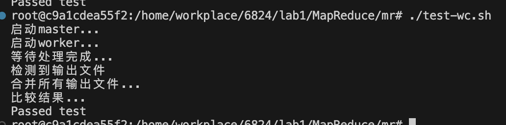
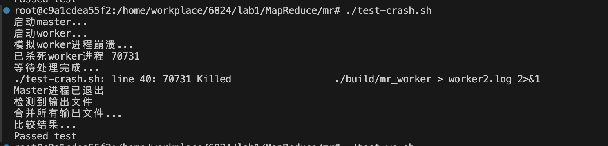
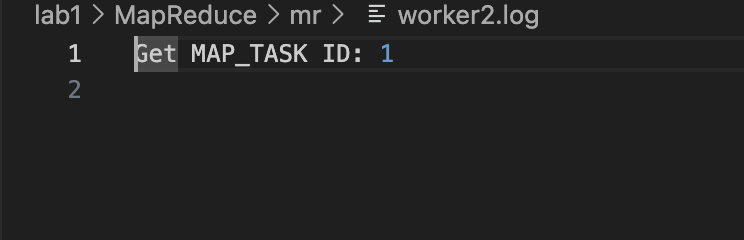
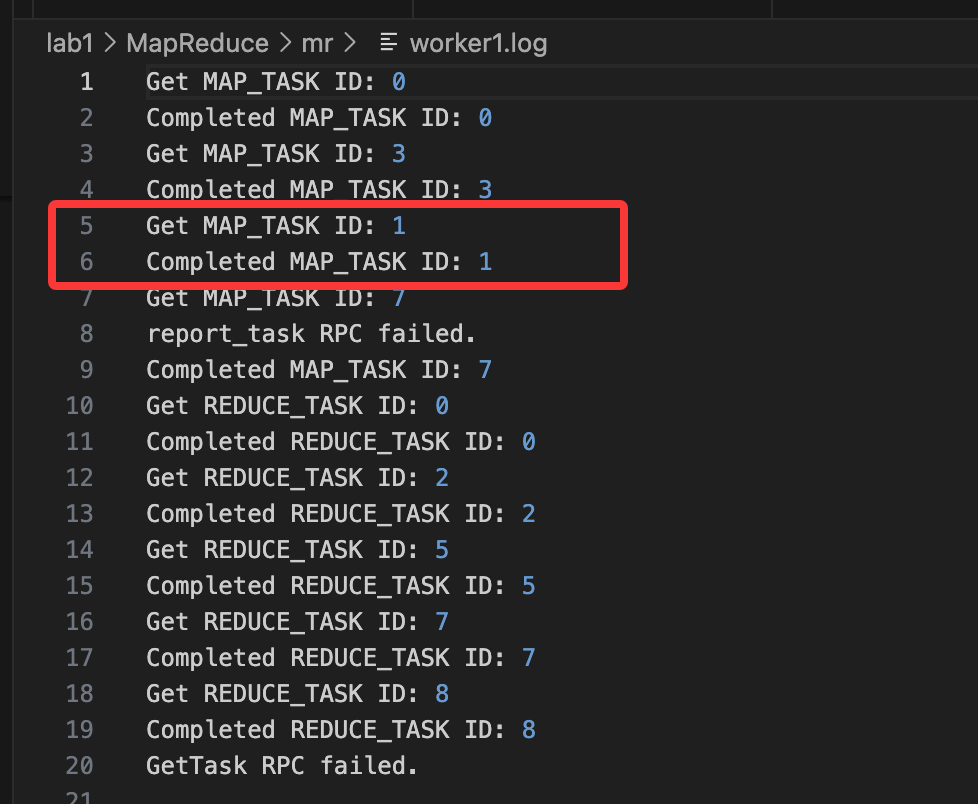

# MIT 6.824 Lab 1: MapReduce 实验要求

## 实验目标

实现一个 MapReduce 系统，包括两个主要组件：

1. **Master 进程** - 负责协调和分配任务
2. **Worker 进程** - 执行实际的 Map 和 Reduce 任务

## 核心功能要求

### Master 职责

- 分配任务给 Worker 进程
- 监控 Worker 状态，处理失败的 Worker
- 跟踪每个任务的状态（未执行、正在执行、已完成）
- 如果 Worker 在规定时间内（通常是 10 秒）未能完成任务，则重新分配该任务

### Worker 职责

- 通过 RPC 向 Master 请求任务
- 执行 Map 或 Reduce 函数
- 处理文件读写操作
- 完成任务后通知 Master

### MapReduce 流程

- **Map 阶段**：处理输入文件，生成中间键值对
- **Shuffle 阶段**：按键排序并分发给相应的 Reduce 任务
- **Reduce 阶段**：处理排序后的中间数据，生成最终输出

## 测试要求

实验通常包括以下测试：

1. **wc test** - 验证单词统计功能是否正确
2. **crash test** - 验证系统在 Worker 崩溃时的健壮性

## 特殊要求

- **容错性**：系统需要能够处理 Worker 崩溃或执行缓慢的情况
- **正确性**：即使在存在故障的情况下也要产生正确的结果
- **并发性**：支持多个 Worker 并行处理任务
- **任务重分配**：当 Worker 失败时，未完成的任务需要重新分配给其他 Worker

## 技术细节

- 使用 C++ 语言实现
- 进程间通过 gRPC 通信
- 在单台机器上通过多个进程模拟分布式环境
- 使用 C++ 插件机制加载用户定义的 Map 和 Reduce 函数

## 输出要求

- 修改 Map 和 Reduce 函数，使 `wc.go` 按字母顺序(alphabetical order)报告每个单词的出现次数

## 设计考虑

这个实验旨在让学生深入理解 MapReduce 分布式计算框架的核心概念和实现细节，包括任务调度、容错处理和并发控制等重要方面。

## 编译执行过程

### 1. 依赖的库

- grpc 和 protobuf
- 建议使用 vcpkg 进行安装，使用其他包安装工具在进行 cmake 编译时会找不到 protobuf-config.cmake 文件

### 2. 编译

```bash
mkdir build && cd build

cmake -DCMAKE_TOOLCHAIN_FILE=D:/vcpkg/scripts/buildsystems/vcpkg.cmake ..

make
```
## 实验结果
1. 运行结果截图：
通过原实验中的test-wc.sh测试(原实验是go写的，这里自己将原实验测试用例改成适配c++)，运行结果如下：


2. worker进程崩溃时，master进程会重新分配任务给新的worker进程。
测试结果如下：

这里将第二个worker进程杀死，master进程会重新分配任务给新的worker进程。


worker2崩溃时，master将worker2分配到的map task1重新分配给了worker1


这里为了能保证worker进程获取到任务后才被杀死，将worker进程的sleep时间调高。
有需要的可以将这个延时去掉


